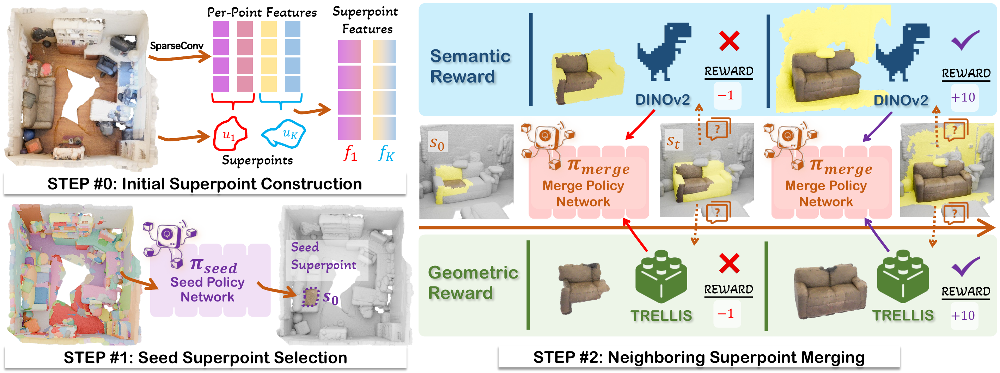
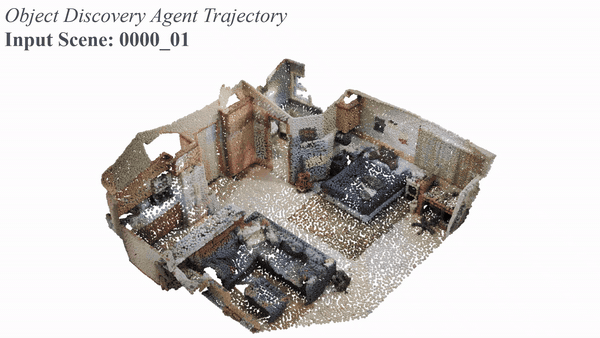

# FoundObj: Self-supervised Foundation Models as Rewards for Label-free 3D Object Segmentation
[](https://arxiv.org/abs/2605.27178)
[](./LICENSE)

## Overview

Official PyTorch implementation of **FoundObj**, a unsupervised framework for 3D class-agnostic object instance segmentation in indoor scenes.

<p align="center">  </p>

Objects are progressively merged by the agent: 

<p align="center">  </p>

Pretrained checkpoints can be found [here](https://huggingface.co/zihui2/FoundObj):

## 1. Environment
### Installing dependencies
The released environment is tested with Python 3.10, PyTorch 2.6, CUDA 12.6, and `spconv-cu126`.
```bash
conda env create -f environment.yml
conda activate foundobj
pip install torch==2.6.0 torchvision==0.21.0 torchaudio==2.6.0 --index-url https://download.pytorch.org/whl/cu126
pip install xformers==0.0.29.post2 --index-url https://download.pytorch.org/whl/cu126
pip install spconv-cu126
pip install torch-scatter -f https://pytorch-geometric.com/whl/torch-2.6.0+cu126.html
conda install -c fvcore -c iopath -c conda-forge fvcore iopath
pip install --no-build-isolation git+https://github.com/facebookresearch/pytorch3d.git@stable
pip install --no-build-isolation git+https://github.com/facebookresearch/detectron2.git
cd pointnet2 && python setup.py install && cd ..
```
If you compile the ScanNet superpoint extension, build the C++ module:
```bash
pip install pybind11
cd preprocessing/cpp_utils
python setup.py build_ext --inplace
cd ../..
```

## 2. Data Preparation
Download [ScanNet](http://kaldir.vc.in.tum.de/scannet_benchmark/documentation) and [S3DIS](https://docs.google.com/forms/d/e/1FAIpQLScDimvNMCGhy_rmBA2gHfDu3naktRm6A8BPwAWWDv-Uhm6Shw/viewform?c=0&w=1),
following [GrabS](https://github.com/vLAR-group/GrabS) to generate the segmentator binary files. Then organize the raw scans locally.
```bash
python preprocessing/scannet_preprocessing.py --data-dir /path/to/scannet --save-dir data/scannet/processed_aligns
python preprocessing/scannet200_preprocessing.py --data-dir /path/to/scannet --save-dir data/scannet/processed_aligns200
python preprocessing/s3dis_preprocessing.py --data-dir /path/to/Stanford3dDataset_v1.2_Aligned_Version --save-dir data/s3dis/processed
```
Before S3DUS preprocessing, check whether the following two issuses existed and fix them manually if needed.
- line 180389 in `Area_5/hallway_6/Annotations/ceiling_1.txt` and `Area_5/office_20/Annotations/table_2.txt`, line 1: remove the empty line.

FoundObj uses point-level superpoints for proposal search. Generate superpoints from ScanNet meshes:
```bash
python preprocessing/get_scannet_superpoints.py --scans-root /path/to/scannet/scans
```
Then build adjacent-superpoint lookup files:
```bash
python preprocessing/get_neighbors.py
```
### DINOv2 Features
Project DINOv2 features onto ScanNet superpoints. The 3D and 2D data are available from [OpenScene](https://github.com/pengsongyou/openscene):
```bash
wget https://cvg-data.inf.ethz.ch/openscene/data/scannet_processed/scannet_3d.zip
wget https://cvg-data.inf.ethz.ch/openscene/data/scannet_processed/scannet_2d.zip
python distillation/project_scannet_features.py --scannet-2d-root /path/to/scannet_2d_images --scannet-3d-root /path/to/scannet_3d_data \
```
### Pseudo Masks
Generate NCut initial pseudo masks:
```bash
python preprocessing/generate_ncut_masks.py --data-root data/scannet/processed_aligns
```

The expected ScanNet layout is:
```text
data/scannet/
|-- processed_aligns/
|-- processed_aligns200/
|-- superpoints/
|-- superpoint_neighbors/
|-- dinov2b14_spfeats/
`-- pseudo_mask/
```


## 3. CenterField
The shape reward module is trained from synthetic object-centric scenes. 
We use ABO and 3D-FUTURE object meshes, with required ScanNet crops for background clutter.

### Prepare Synthetic Object Scenes
The filtered object lists are provided in `preprocessing_obj/object_lists/`. They come from TRELLIS-500K metadata and keep only objects with `aesthetic_score >= 4.5`.
The [3D-Future](https://tianchi.aliyun.com/dataset/98063) needs to download manually before processing, while ABO can be automatically downloaded by the script. 
**Noe the 3D-Future dataset downlaod links are not available now**. 
Therefore we also release the [processed data](https://huggingface.co/zihui2/FoundObj).

If you want to prepare by your own, please follow the instructions below:

```
# ABO: downloads abo-3dmodels.tar from the public ABO S3 bucket, then extracts the selected .glb files
python preprocessing_obj/prepare_objects.py --dataset ABO
python preprocessing_obj/prepare_objects.py --dataset 3D-Future --models_root /path/to/3D-FUTURE_raw
```
The expected files are `3D-FUTURE-model/<instance>/raw_model.obj`.

Build synthetic scenes and partial point clouds:
```bash
python preprocessing_obj/create_scene_mesh.py
python preprocessing_obj/render_single_view.py
python preprocessing_obj/extract_obj_surf.py
python preprocessing_obj/combine_views.py
python preprocessing_obj/split_samples.py
```
The expected object data layout is:
```text
data/objects/
|-- ABO/
|   |-- renders/
|   |-- syn_mesh/
|   |-- syn_depth/
|   |-- syn_scene_pc/
|   `-- syn_traindata/
|-- 3D-Future/
|   `-- ...
`-- Others_augobj/
```
### Train CenterField
```bash
# Trellis sparse-structure backbone
python train_cf/train_cf.py --data_dir data/objects/ABO,data/objects/3D-Future --save_path ckpt/centerfield
```
The trained CenterField checkpoint, e.g. `ckpt/centerfield/ckpt_step_300000.tar`, is used by `train_cutcost.py`.


## 4. Segmentation Training on ScanNet
Train FoundObj with the PPO proposal policy and CutCost reward:
```bash
python train_cutcost.py --data-root data/scannet/processed_aligns --superpoint-dir data/scannet/superpoints --dino-dir data/scannet/dinov2b14_spfeats --superpoint-neighbor-dir data/scannet/superpoint_neighbors --pre-pseudo data/scannet/pseudo_mask --center-field-ckpt ckpt/centerfield/ckpt_step_300000.tar --save-path ckpt/foundobj
```


## 5. Evaluation
### ScanNet200
```bash
CUDA_VISIBLE_DEVICES=0 python eval_scannet.py --ckpt /path/to/checkpoint.tar --data-root data/scannet/processed_aligns200 -superpoint-dir data/scannet/superpoints --save-path outputs/eval_scannet
```
### S3DIS
## Build S3DIS Superpoints
The S3DIS superpoint script requires two C++ extensions. Install dependencies and compile:
```bash
sudo apt-get install -y libeigen3-dev #or conda install -c conda-forge eigen if sudo is unavailable
pip install pybind11

cd preprocessing/partition
c++ -O3 -shared -std=c++11 -fPIC -fopenmp $(python3 -m pybind11 --includes) -I./include cutpursuit_pybind.cpp -o ../libcp$(python3-config --extension-suffix)
c++ -O3 -shared -std=c++11 -fPIC -fopenmp $(python3 -m pybind11 --includes) -I/usr/include/eigen3 ply_c_pybind.cpp -o ../libply_c$(python3-config --extension-suffix)
cd ../..
```

Then generate superpoints:
```bash
python preprocessing/prepare_s3dis_superpoints_fast.py --input-path data/s3dis/processed --sp-save-path data/s3dis/superpoints 
```
And evaluate the S3DIS segmentation results:
```bash
CUDA_VISIBLE_DEVICES=0 python eval_s3dis.py --ckpt /path/to/checkpoint.tar --data-dir data/s3dis/processed --sp-dir data/s3dis/superpoints --test-area Area_5 --save-path outputs/eval_s3dis
```
